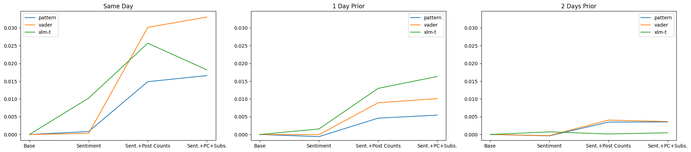

# reddit-stock-sentiment

This repository contains code for the dissertation project "Exploring the Relationship between Stock Returns and Social Media Sentiments" by Inje Kim. The research aims to explore the impact of sentiments from Reddit posts on the explanatory power of the Fama French three-factor model for seven popular stocks (AAPL, GME, MCD, MSFT, NFLX, NVDA, TSLA).

## Data Sources

* Reddit post data was collected from Pushshift and then filtered using a [simple keyword search script](https://github.com/injekim/PushshiftDumps) based on [Watchful1's script](https://github.com/Watchful1/PushshiftDumps).

* The Fama French three-factors were collected from the [Kenneth R. French - Data Library](https://mba.tuck.dartmouth.edu/pages/faculty/ken.french/data_library.html).

* Historic stock data was collected from Yahoo Finance using [yfinance library](https://github.com/ranaroussi/yfinance).

* Reddit subscriber counts were collected using RedditAPI.

## How to Run

If you wish to replicare the tests, follow these steps:

1. **Setup Data**: Download `posts.csv`, `stock_index.csv`, and `subreddit_subscribers.csv` from this Kaggle link: [Reddit-Stock related posts](https://www.kaggle.com/datasets/injek0626/reddit-stock-related-posts?datasetId=3431669). Place the files in the root directory of the repository.
2. **Prepare Post Data**: Execute `prepare_posts.ipynb` to preprocess the post data and categorise them by stocks for sentiment analysis.
3. **Calculate Sentiments**: Launch `get_sentiment.ipynb` to calculate sentiment scores from the post data.
4. **Explanatory Data Analysis**: `eda.ipynb` contains explanatory data analysis (EDA) related to the research.
5. **Model & Results**: Run `model.ipynb` to perform the tests and view the results.

## Results

This research utilised three sentiment analysis techniques - Vader, Pattern, and XLM-T - to determine the impact of Reddit sentiments on improving the Fama French three-factor model's explanatory power.

The study also factored in daily post counts and subreddit subscriber counts to assess the impact of user engagement.

The above plots display the adjusted R-squared scores for the basic Fama French three-factor model and its three variations that include sentiment data. The plot on the far left uses sentiment data from the same day. By adding sentiment factors, there's a clear enhancement in the model's R-squared score. Vader performed the best, increasing the score by 3.31%. Additionally, the effects of post counts and subscriber counts can be clearly seen as their inclusion improves the scores even further.

|      | aapl      | gme      | mcd   | msft      | nflx     | nvda      | tsla      | mean     |
|------|-----------|----------|-------|-----------|----------|-----------|-----------|----------|
| P>&#124;t&#124; | 2.35e-10 | 1.12e-11 | 0.001 | 3.25e-18 | 1.39e-04 | 9.98e-11  | 6.92e-10  | 1.96e-04 |

A look at the p-values reveals that all seven stocks had values below 0.05, indicating a statistically significant connection.

When incorporating sentiment data from the previous day, results still outperformed the base model, though not as much as same-day data. Here, XLM-T performed the best, improving the score by 1.63%. The role of post counts and subscriber numbers remained noticeable.

|      | aapl   | gme      | mcd   | msft      | nflx     | nvda  | tsla  | mean     |
|------|--------|----------|-------|-----------|----------|-------|-------|----------|
| P>&#124;t&#124; | 0.009 | 1.13e-04 | 0.462 | 6.70e-04  | 4.85e-17 | 0.499 | 0.016 | 0.141    |

Upon analysing the p-values, 5 out of the 7 stocks still had values below 0.05, indicating a slight reduction in its effectiveness.

When using sentiments from 2 days prior, the effectiveness waned. Vader once again performed the best, but only with a marginal improvement of 0.41%. By this point, the influences of post and subscriber counts had largely faded.

|      | aapl  | gme   | mcd   | msft      | nflx  | nvda  | tsla  | mean  |
|------|-------|-------|-------|-----------|-------|-------|-------|-------|
| P>&#124;t&#124; | 0.032 | 0.151 | 0.070 | 1.55e-12 | 0.900 | 0.005 | 0.412 | 0.224 |

For this set, p-values for just 3 of the 7 stocks were below 0.05, further indicating the diminishing effects of older sentiment data.